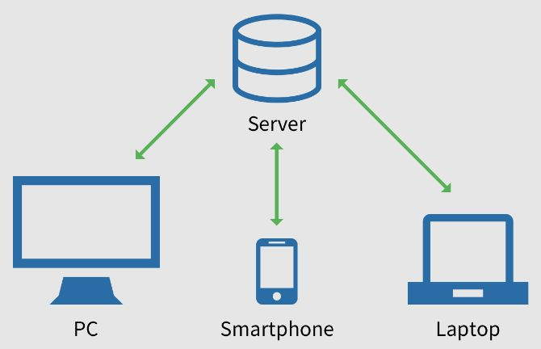

[**_``Go Back``_**](../README.md)

# Introduction

``Network programming`` is the act of using computer code to write programs or processes that can communicate with other programs or processes across a network.

> Note: ``Network Programming`` involves writing programs that communicate with other programs across a computer network.

## Network Programming Features & Scope
-----------------------------------------
Network programming is the process of developing software applications that communicate with other computers over a network. It involves the use of various programming languages, tools, and protocols to enable network communication and exchange of data between computers.

Some of the key features of network programming include:

- **``Socket programming``**: This is the foundation of network programming and involves the creation and manipulation of network sockets to enable network communication.

- **``Client-server architecture``**: This is a common architecture used in network programming where a server provides services to clients, which request and receive data from the server.

- **``Web programming``**: This involves the development of applications that run on the World Wide Web, using web technologies such as HTML, CSS, JavaScript, and various web frameworks and libraries.

- **``Distributed systems``**: This involves the development of applications that are distributed across multiple computers in a network, and communicate with each other to achieve a common goal.

- **``Network security``**: This involves the use of various security mechanisms to protect data and ensure secure communication over a network.

The scope of network programming is vast and includes a wide range of applications and technologies, such as:

- **``Networked games``**: This involves the development of games that are played over a network, allowing players to connect and compete with each other online.

- **``Internet of Things (IoT)``**: This involves the development of applications that allow devices to communicate with each other over a network, enabling smart homes, connected cars, and other IoT applications.

- **``Cloud computing``**: This involves the use of network programming to develop and deploy applications on the cloud, using services such as ``Amazon Web Services (AWS)``, ``Google Cloud``, and ``Microsoft Azure``.

- **``Web services``**: This involves the development of applications that provide services over the web, using protocols such as ``HTTP``, ``SOAP``, and ``REST``.

- **``Real-time communication``**: This involves the development of applications that enable real-time communication over a network, such as video conferencing, voice over IP (VoIP), and instant messaging.

## Network Programming Language, Tool & Platform
-------------------------------------------------
Network programming can be done with various programming languages, tools, and platforms. Here are some popular choices:

**Programming Languages**

- **``Python``**: ``Python`` is a popular choice for network programming due to its simplicity, ease of use, and extensive library support, including libraries for socket programming, ``HTTP`` requests, and ``JSON/XML`` parsing.

- **``Java``**: ``Java`` is another popular choice for network programming due to its platform independence, extensive libraries, and support for multithreading, which is essential for building scalable network applications.

- **``C/C++``**: ``C`` and ``C++`` are commonly used for network programming due to their low-level control, which enables efficient memory management and socket programming.

**Tools**

- **``Wireshark``**: ``Wireshark`` is a popular tool for network packet analysis, which enables developers to debug and troubleshoot network communication issues.

- **``Postman``**: ``Postman`` is a tool for testing APIs, which enables developers to send ``HTTP`` requests and receive responses, making it easy to test and debug web applications.

- **``Docker``**: ``Docker`` is a containerization platform that enables developers to build and deploy applications as lightweight, portable containers, making it easy to scale and manage network applications.

**Platforms**

- **``Linux``**: ``Linux`` is a popular operating system for network programming due to its robust networking stack, support for various programming languages, and open-source nature.

- **``Windows``**: ``Windows`` is another popular operating system for network programming, particularly for developing applications that run on the ``.NET`` Framework.

- **``Cloud platforms``**: Cloud platforms such as ``Amazon Web Services (AWS)``, ``Google Cloud``, and ``Microsoft Azure`` provide a scalable and flexible environment for developing and deploying network applications.

Overall, the choice of language, tools, and platform for network programming depends on the specific requirements of the application, as well as the skills and experience of the development team

## Client and Server Application
---------------------------------
In **Network programming**, the concepts of **clients** and **servers** are fundamental and form the basis for building various types of networked applications. Clients and servers interact to enable communication and data exchange over computer networks. Below are explanations of clients and servers and examples of applications for each:

### **Clients**

``Clients`` are software applications or devices that initiate requests for services or resources from servers.

**Responsibilities:**

- ``Clients`` send requests to servers and await responses.

- They may establish connections to servers, send data, and handle server **responses**.

**Examples of Client Applications:**

- **``Web Browsers``**: Web browsers like ``Google Chrome``, ``Mozilla Firefox``, and ``Microsoft Edge`` are client applications that request and display web pages from web servers.

- **``Email Clients``**: Email clients such as ``Microsoft Outlook``, ``Mozilla Thunderbird``, and ``Apple Mail`` retrieve and send emails from/to email servers.

- **``FTP Clients``**: ``FTP (File Transfer Protocol)`` clients like ``FileZilla`` and ``WinSCP`` enable users to upload and download files to/from FTP servers.

- **``Instant Messaging Clients``**: Applications like ``WhatsApp``, ``Slack``, and ``Skype`` allow users to send messages to others via centralized servers.

**Client-Server Interaction:**

- ``Clients`` initiate communication with servers by making requests (e.g., ``HTTP GET`` requests in web browsers).

- They establish connections (e.g., ``TCP`` connections) to servers and exchange data (e.g., ``HTTP`` **requests** and **responses**).

- Clients may use various protocols (e.g., ``HTTP``, ``FTP``, ``SMTP``) to communicate with servers, depending on the application's requirements.

### **Servers**

``Servers`` are software applications or devices that provide services or resources to clients.

**Responsibilities:**

- ``Servers`` listen for incoming **requests** from clients.

- They process these **requests**, perform requested actions, and send **responses** back to clients.

**Examples of Server Applications:**

- ``Web Servers``: Web servers like ``Apache``, ``Nginx``, and ``Microsoft IIS`` serve web pages, images, and other web content to web browsers.

- ``Email Servers``: Email servers such as ``Microsoft Exchange Server``, ``Postfix``, and ``Sendmail`` handle email storage, delivery, and retrieval for email clients.

- ``File Servers``: File servers like ``Windows Server`` and ``Samba`` provide centralized file storage and access for network users.

- ``Chat Servers``: Chat servers like ``IRC (Internet Relay Chat)`` servers and ``XMPP (Extensible Messaging and Presence Protocol)`` servers facilitate real-time messaging for chat clients.

- ``Game Servers``: Game servers for online multiplayer games like ``Minecraft``, ``Counter-Strike``, and ``World of Warcraft`` enable gameplay and interaction for game clients.

**Server-Client Interaction:**

- ``Servers`` listen for incoming connections on specific ports (e.g., port ``80`` for ``HTTP``, port ``25`` for ``SMTP``).

- When a ``client`` connects, the server processes the **request** and sends a **response**, which may include data or services **requested** by the client.

## Client Server Model and Software Design
--------------------------------------------

### **Client-Server Model**

The ``client-server`` model is a fundamental architectural approach in network programming where two types of software components, **clients** and **servers**, collaborate to enable communication and data exchange over a network. This model divides the responsibilities of a distributed application into distinct roles:

- **``Client``**: Clients are software applications or devices that initiate requests for services, data, or resources from servers. They are responsible for making requests, sending data, and processing responses. Clients typically represent end-users or consumer-facing interfaces.

- **``Server``**: Servers are software applications or devices that provide services, data, or resources in response to client requests. They listen for incoming requests, process them, perform actions, and return results. Servers act as providers of services or data to clients.

In the ``client-server`` model, clients and servers communicate using established protocols, such as ``HTTP``, ``FTP``, or custom communication protocols. Clients initiate communication by sending requests to servers, and servers respond by fulfilling those requests. This model allows for the efficient distribution of tasks and resources in a networked environment, making it suitable for a wide range of applications, from web services to database systems.

### **Software Design**

In the context of **Network Programming**, software design encompasses the process of conceptualizing, planning, and structuring software applications that operate over computer networks. Designing networked software involves several key considerations:

- **``Architecture``**: Choose the appropriate architectural pattern, such as the ``client-server`` model, ``peer-to-peer``, or ``hybrid`` architectures, based on the application's requirements and goals.

- **``Communication Protocols``**: Select the communication protocols and data formats for exchanging information between **clients** and **servers**. Define the structure of messages and requests.

- **``Security``**: Implement security measures to protect data during transmission and storage. Include **authentication**, **authorization**, and **encryption** mechanisms to safeguard sensitive information.

- **``Data Management``**: Plan how data will be **stored**, **organized**, and **accessed** on both the ``client`` and ``server`` sides. Design **data models**, **schemas**, and **database structures**.

- **``Scalability``**: Consider the application's scalability requirements and design it to handle increased loads and traffic. Implement load balancing and distributed computing strategies if necessary.

- **``Error Handling``**: Develop robust ``error-handling`` mechanisms to gracefully manage exceptions and failures. Implement **logging** and **monitoring** to aid in debugging and troubleshooting.