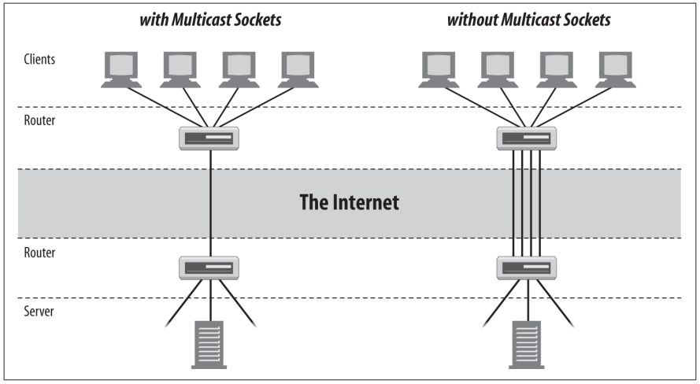

<div align="center">

[**_``Go Back``_**](../README.md)

# IP multicast

</div>

IP multicast is a method of sending Internet Protocol (IP) datagrams to a group of interested receivers in a single transmission. It is the IP-specific form of multicast and is used for streaming media and other network applications. It uses specially reserved multicast address blocks in ``IPv4`` and ``IPv6``.

## Multicasting
----------------
Multicasting is the process of sending data to a multicast group, which is identified by a multicast IP address. Network programming applications can use multicasting to efficiently distribute data to multiple recipients while conserving network bandwidth.

### **Multicast Addresses and Groups**
A ``Multicast Address`` is the shared address of a group of hosts called a ``Multicast Group``.

#### Multicast Addresses
**Multicast Address** is a logical identifier for a group of hosts in a computer network that are available to process datagrams or frames intended to be multicast for a designated network service. Multicast addresses are IPv4 addresses used for multicast communication, typically in the range ``224.0.0.0`` to ``239.255.255.255``.

#### Multicast Groups
**Multicast Groups** are logical groups of recipients who are interested in receiving multicast traffic sent to a specific multicast address.In other words, it is logical collections of receivers or hosts that express interest in receiving multicast data sent to a specific multicast IP address.

### **Clients and Servers**
In network programming, clients and servers are entities that participate in multicast communication.

- ``Server`` is responsible for sending multicast data to a multicast group.

- ``Clients`` are devices or applications that join multicast groups to receive data sent by the server.

Network programming often involves designing both multicast servers and clients to facilitate efficient communication.

### **Routers and Routing**
In multicast communication, **routers and routing protocols** play a crucial role in ensuring that multicast traffic is efficiently and selectively delivered to the appropriate recipients.

- ``Routers`` play a crucial role in ``IP Multicast`` by forwarding multicast traffic to the appropriate network segments.
- Routing protocols, such as ``Protocol Independent Multicast (PIM)``, are used to manage multicast group membership and control the distribution of multicast data.
- Network programmers need to understand how routers handle multicast traffic and how to configure routers for optimal multicast routing.

<div align="center">



</div>

## Working with Multicast Sockets
----------------------------------
Enough theory. In Java, you multicast data using the ``java.net.MulticastSocket`` class, a subclass of ``java.net.DatagramSocket``:

```Java
public class MulticastSocket extends DatagramSocket implements Closeable, AutoCloseable
```
As you would expect, ``MulticastSocket``’s behavior is very similar to ``DatagramSocket``’s: you put your data in ``DatagramPacket`` objects that you **send** and **receive** with the ``MulticastSocket``.

To receive data that is being multicast from a remote site, first create a ``MulticastSocket`` with the **``MulticastSocket()``** constructor. As with other kinds of sockets, you need to know the port to listen on. This code fragment opens a ``MulticastSocket`` that listens on port **2300**:

```Java
MulticastSocket ms = new MulticastSocket(2300);
```
Next, join a multicast group using the ``MulticastSocket``’s **``joinGroup()``** method:

```Java
InetAddress group = InetAddress.getByName("224.2.2.2");
ms.joinGroup(group);
```
This signals the routers in the path between you and the server to start sending data your way and tells the local host that it should pass you IP packets addressed to the multicast group.

Once you’ve joined the multicast group, you receive UDP data just as you would with a ``DatagramSocket``. You create a ``DatagramPacket`` with a byte array that serves as a buffer for data and enter a loop in which you receive the data by calling the **``receive()``** method inherited from the ``DatagramSocket`` class:

```Java
byte[] buffer = new byte[8192];
DatagramPacket dp = new DatagramPacket(buffer, buffer.length);
ms.receive(dp);
```
When you no longer want to receive data, leave the multicast group by invoking the socket’s **``leaveGroup()``** method. You can then close the socket with the **``close()``** method inherited from ``DatagramSocket``:

```Java
ms.leaveGroup(group);
ms.close();
```

Sending data to a multicast address is similar to sending ``UDP`` data to a unicast address. You do not need to join a multicast group to send data to it. You create a new ``DatagramPacket``, stuff the data and the address of the multicast group into the packet, and pass it to the **``send()``** method:

```Java
InetAddress ia = InetAddress.getByName("experiment.mcast.net");
byte[] data = "Here's some multicast data\r\n".getBytes("UTF-8");
int port = 4000;
DatagramPacket dp = new DatagramPacket(data, data.length, ia, port);
MulticastSocket ms = new MulticastSocket();
ms.send(dp);
```
There is one caveat to all this: multicast sockets are a security hole big enough to drive a small truck through. Consequently, untrusted code running under the control of a ``SecurityManager`` is not allowed to do anything involving multicast sockets. Remotely loaded code is normally only allowed to **send datagrams** to or **receive datagrams** from the host it was downloaded from. However, multicast sockets don’t allow this sort of restriction to be placed on the packets they send or receive. Once you send data to a multicast socket, you have very limited and unreliable control over which hosts receive that data. Consequently, most environments that execute remote code take the conservative approach of disallowing all multicasting.

### **The Constructors**

The constructors are simple. You can either pick a port to listen on or let Java assign an anonymous port for you:

```Java
public MulticastSocket() throws SocketException
```
```Java
public MulticastSocket(int port) throws SocketException
```
```Java
public MulticastSocket(SocketAddress bindAddress) throws IOException
```

For example:

```Java
MulticastSocket ms1 = new MulticastSocket();
MulticastSocket ms2 = new MulticastSocket(4000);
SocketAddress address = new InetSocketAddress("192.168.254.32", 4000);
MulticastSocket ms3 = new MulticastSocket(address);
```
All three constructors throw a ``SocketException`` if the Socket can’t be created. If you don’t have sufficient privileges to bind to the port or if the port you’re trying to bind to is already in use, then a Socket cannot be created. Note that because a multicast socket is a datagram socket as far as the operating system is concerned, a ``MulticastSocket`` cannot occupy a port already occupied by a ``DatagramSocket``, and vice versa.

You can pass ``null`` to the constructor to create an unbound socket, which will be connected later with the **``bind()``** method. This is useful when setting socket options that can only be set before the socket is bound. For example, this code fragment creates a multicast socket with ``SO_REUSEADDR`` disabled (that option is normally enabled by default for multicast sockets):

```Java
MulticastSocket ms = new MulticastSocket(null);
ms.setReuseAddress(false);
SocketAddress address = new InetSocketAddress(4000);
ms.bind(address);
```

### **Communicating with a Multicast Group**

Once a ``MulticastSocket`` has been created, it can perform four key operations:

1. Join a multicast group.
2. Send data to the members of the group.
3. Receive data from the group.
4. Leave the multicast group.

The ``MulticastSocket`` class has methods for operations ``1`` and ``4``. No new methods are required to send or receive data. The **``send()``** and **``receive()``** methods of the superclass, ``DatagramSocket``, suffice for those operations. You can perform these operations in any order, with the exception that you must join a group before you can receive data from it. You do not need to join a group to send data to it, and you can freely intermix sending and receiving data.

#### Joining groups

To join a group, pass an ``InetAddress`` or a ``SocketAddress`` for the multicast group to the **``joinGroup()``** method:

```Java
public void joinGroup(InetAddress address) throws IOException
```
```Java
public void joinGroup(SocketAddress address, NetworkInterface interface) throws IOException
```
Once you’ve joined a multicast group, you receive datagrams exactly as you receive unicast datagrams . That is, you set up a ``DatagramPacket`` as a buffer and pass it into this socket’s **``receive()``** method. For example:

```Java
try {
    MulticastSocket ms = new MulticastSocket(4000);
    InetAddress ia = InetAddress.getByName("224.2.2.2");
    ms.joinGroup(ia);
    byte[] buffer = new byte[8192];
    while (true) {
        DatagramPacket dp = new DatagramPacket(buffer, buffer.length);
        ms.receive(dp);
        String s = new String(dp.getData(), "8859_1");
        System.out.println(s);
    }
}catch (IOException ex) {
    System.err.println(ex);
}
```
If the address that you try to join is not a multicast address (***if it is not between ``224.0.0.0`` and ``239.255.255.255``***), the **``joinGroup()``** method throws an ``IOException``.

A single ``MulticastSocket`` can join multiple multicast groups. Information about membership in multicast groups is stored in multicast routers, not in the object. In this case, you’d use the address stored in the incoming datagram to determine which address a packet was intended for.

Multiple multicast sockets on the same machine and even in the same Java program can all join the same group. If so, each socket receives a complete copy of the data addressed to that group that arrives at the local host.

A second argument allows you to join a multicast group only on a specified local network interface. For example, this code fragment attempts to join the group with IP address ``224.2.2.2`` on the network interface named ``“eth0”``, if such an interface exists. If no such interface exists, then it joins on all available network interfaces:

```Java
MulticastSocket ms = new MulticastSocket();
SocketAddress group = new InetSocketAddress("224.2.2.2", 40);
NetworkInterface ni = NetworkInterface.getByName("eth0");
if (ni != null) {
    ms.joinGroup(group, ni);
} else {
    ms.joinGroup(group);
}
```
Other than the extra argument specifying the network interface to listen from, this behaves pretty much like the single-argument **``joinGroup()``** method. For instance, passing a ``SocketAddress`` object that does not represent a multicast group as the first argument throws an **``IOException``**.

#### Leaving groups and closing the connection

Call the **``leaveGroup()``** method when you no longer want to receive datagrams from the specified multicast group, on either all or a specified network interface:

```Java
public void leaveGroup(InetAddress address) throws IOException
```
```Java
public void leaveGroup(SocketAddress multicastAddress, NetworkInterface interface) throws IOException
```
It signals the local multicast router, telling it to stop sending you datagrams. If the address you try to leave is not a multicast address (***if it is not between ``224.0.0.0`` and ``239.255.255.255``***), the method throws an ``IOException``. However, no exception occurs if you leave a multicast group you never joined.

Pretty much all the methods in ``MulticastSocket`` can throw an ``IOException``, so you’ll usually wrap all this in a try block. In Java 7, ``DatagramSocket`` implements ``Autocloseable`` so you can use **try-with-resources**:

```Java
try (MulticastSocket socket = new MulticastSocket()) {
    // connect to the server...
} catch (IOException ex) {
    ex.printStackTrace();
}
```
In Java 6 and earlier, you’ll want to explicitly close the socket in a finally block to release resources the socket holds:

```Java
MulticastSocket socket = null;
try {
    socket = new MulticastSocket();
    // connect to the server...
} catch (IOException ex) {
    ex.printStackTrace();
} finally {
    if (socket != null) {
        try {
            socket.close();
        } catch (IOException ex) {
            // ignore
        }
    }
}
```

#### Sending multicast data

Sending data with a ``MulticastSocket`` is similar to sending data with a ``DatagramSocket``. Stuff your data into a ``DatagramPacket`` object and send it off using the **``send()``** method inherited from ``DatagramSocket``. The data is sent to every host that belongs to the multicast group to which the packet is addressed. For example:

```Java
try {
    InetAddress ia = InetAddress.getByName("experiment.mcast.net");
    byte[] data = "Here's some multicast data\r\n".getBytes();
    int port = 4000;
    DatagramPacket dp = new DatagramPacket(data, data.length, ia, port);
    MulticastSocket ms = new MulticastSocket();
    ms.send(dp);
} catch (IOException ex) {
    System.err.println(ex);
}
```
By default, multicast sockets uses a ``TTL`` of ``1`` (that is, packets don’t travel outside the local subnet). However, you can change this setting for an individual packet by passing an integer from ``0`` to ``255`` as the first argument to the constructor.

The **``setTimeToLive()``** method sets the default TTL value used for packets sent from the socket using the send(``DatagramPacket dp``) method inherited from ``DatagramSocket`` (***as opposed to the ``send(DatagramPacket dp, byte ttl)`` method in ``MulticastSocket``***). The **``getTimeToLive()``** method returns the default ``TTL`` value of the ``MulticastSocket``:

```Java
public void setTimeToLive(int ttl) throws IOException
```
```Java
public int getTimeToLive() throws IOException
```

For example, this code fragment sets a ``TTL`` of ``64``:

```Java
try {
    InetAddress ia = InetAddress.getByName("experiment.mcast.net");
    byte[] data = "Here's some multicast data\r\n".getBytes();
    int port = 4000;
    DatagramPacket dp = new DatagramPacket(data, data.length, ia, port);
    MulticastSocket ms = new MulticastSocket();
    ms.setTimeToLive(64);
    ms.send(dp);
} catch (IOException ex) {
    System.err.println(ex);
}
```

#### Loopback mode

Whether or not a host receives the multicast packets it sends is platform dependent that is, whether or not they loop back. Passing ``true`` to **``setLoopback()``** indicates you don’t want to receive the packets you send. Passing ``false`` indicates you do want to receive the packets you send:

```Java
public void setLoopbackMode(boolean disable) throws SocketException
```
```Java
public boolean getLoopbackMode() throws SocketException
```

However, this is only a hint. Implementations are not required to do as you request. Because loopback mode may not be followed on all systems, it’s important to check what the loopback mode is if you’re both sending and receiving packets. The **``getLoopbackMode()``** method returns ``true`` if packets are not looped back and ``false`` if they are. (This feels backward to me. I suspect this method was written by a programmer following the ill-advised convention that defaults should always be ``true``.)

If the system is looping packets back and you don’t want it to, you’ll need to recognize the packets somehow and discard them. If the system is not looping the packets back and you do want it to, store copies of the packets you send and inject them into your internal data structures manually at the same time you send them. You can ask for the behavior you want with **``setLoopback()``**, but you can’t count on it.

#### Network interfaces

On a multihomed host, the **``setInterface()``** and **``setNetworkInterface()``** methods choose the network interface used for multicast **sending** and **receiving**:

```Java
public void setInterface(InetAddress address) throws SocketException
```
```Java
public InetAddress getInterface() throws SocketException
```
```Java
public void setNetworkInterface(NetworkInterface interface) throws SocketException
```
```Java
public NetworkInterface getNetworkInterface() throws SocketException
```
The setter methods throw a ``SocketException`` if the argument is not the address of a network interface on the local machine. It is unclear why the network interface is immutably set in the constructor for unicast ``Socket`` and ``DatagramSocket`` objects but is variable and set with a separate method for ``MulticastSocket`` objects. To be safe, set the interface immediately after constructing a ``MulticastSocket`` and don’t change it there‐ after. Here’s how you might use **``setInterface()``**:

```Java
try {
    InetAddress ia = InetAddress.getByName("www.ibiblio.org");
    MulticastSocket ms = new MulticastSocket(2048);
    ms.setInterface(ia);
    // send and receive data...
} catch (UnknownHostException ue) {
    System.err.println(ue);
} catch (SocketException se) {
    System.err.println(se);
}
```

The ``setNetworkInterface()`` method serves the same purpose as the ``setInterface()`` method; that is, it chooses the network interface used for multicast sending and receiving. However, it does so based on the local name of a network interface such as ``“eth0”`` (***as encapsulated in a ``NetworkInterface object``***) rather than on the IP address bound to that network interface (as encapsulated in an ``InetAddress object``). **``setNetworkInterface()``** throws a ``SocketException`` if the ``NetworkInterface`` passed as an argument is not a network interface on the local machine.

The **``getNetworkInterface()``** method returns a ``NetworkInterface`` object representing the network interface on which this ``MulticastSocket`` is listening for data. If no network interface has been explicitly set in the constructor or with **``setNetworkInterface()``**, it returns a placeholder object with the address ``“0.0.0.0”`` and the index ``–1``. For example, this code fragment prints the network interface used by a socket:\

```Java
NetworkInterface intf = ms.getNetworkInterface();
System.out.println(intf.getName());
```

## Example
------------

## Write a network program in java to send message as "BCA student " in multicast group (224.0.01)

**Sender Program:**
```Java
import java.net.DatagramPacket;
import java.net.InetAddress;
import java.net.MulticastSocket;

public class MulticastSender {
    public static void main(String[] args) {
        try {
            String message = "BCA student";
            InetAddress group = InetAddress.getByName("224.0.0.1"); // Multicast group address
            int port = 8888; // Port number

            MulticastSocket socket = new MulticastSocket();
            socket.setTimeToLive(1); // Set the TTL value for the multicast packet

            byte[] messageBytes = message.getBytes();
            DatagramPacket packet = new DatagramPacket(messageBytes, messageBytes.length, group, port);

            socket.send(packet);

            System.out.println("Sent: " + message);

            socket.close();
        } catch (Exception e) {
            e.printStackTrace();
        }
    }
}
```

**Receiver Program:**
```Java
import java.net.DatagramPacket;
import java.net.InetAddress;
import java.net.MulticastSocket;

public class MulticastReceiver {
    public static void main(String[] args) {
        try {
            InetAddress group = InetAddress.getByName("224.0.0.1"); // Multicast group address
            int port = 8888; // Port number

            MulticastSocket socket = new MulticastSocket(port);
            socket.joinGroup(group);

            byte[] buffer = new byte[1024];
            DatagramPacket packet = new DatagramPacket(buffer, buffer.length);

            System.out.println("Waiting for messages...");

            while (true) {
                socket.receive(packet);
                String message = new String(packet.getData(), 0, packet.getLength());
                System.out.println("Received: " + message);
            }
        } catch (Exception e) {
            e.printStackTrace();
        }
    }
}
```