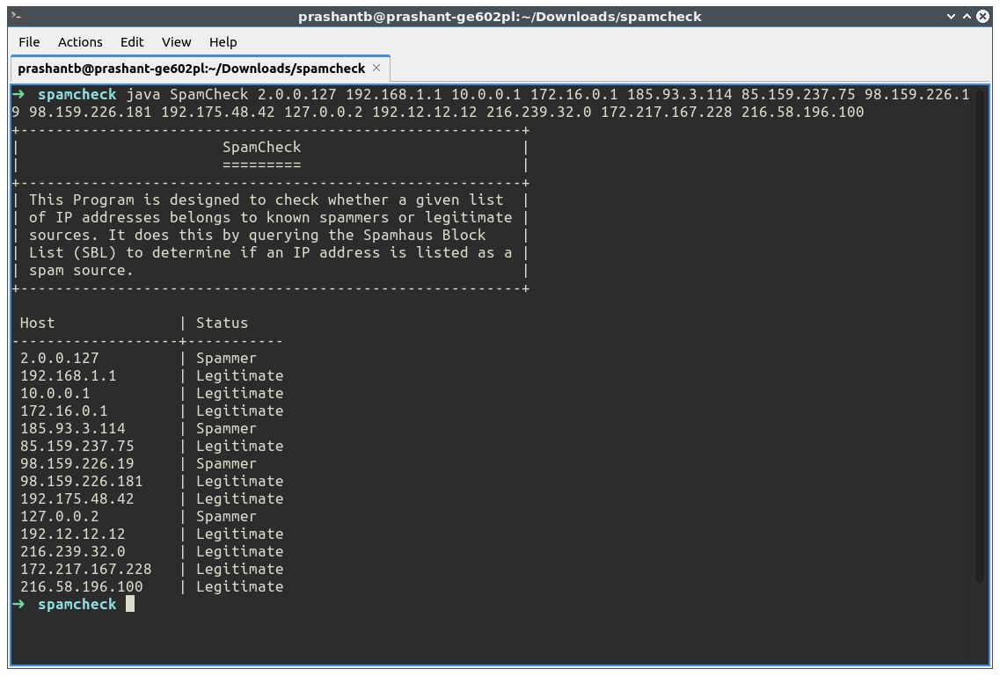

<div align="center">

[**_``Go Back``_**](../README.md)

# Internet Addresses

</div>

In ``Network Programming``, an ``Internet address``, often referred to as an ``IP address``, is a numerical label assigned to each device participating in a computer network that uses the Internet Protocol for communication. These addresses serve two main purposes:

- **``Host Identification``**: ``IP`` addresses uniquely identify devices on a network, allowing data packets to be sent to and received by the correct destination.

- **``Routing``**: ``IP`` addresses are used by routers and network devices to route data packets from the source to the destination, ensuring that data reaches its intended recipient.

There are two versions of the ``Internet Protocol`` currently in use:

- **``IPv4 (Internet Protocol version 4)``**: This is the older and most widely used version of IP. IPv4 addresses consist of four sets of decimal numbers (e.g., ``192.168.1.1``) and have a limited address space, resulting in address exhaustion as more devices connect to the Internet.

- **``IPv6 (Internet Protocol version 6)``**: ``IPv6`` was developed to address the limitations of ``IPv4`` and provides a vastly expanded address space. IPv6 addresses are longer and are typically represented in **hexadecimal notation** (e.g., ``2001:0db8:85a3:0000:0000:8a2e:0370:7334``).

In network programming, developers often work with ``IP addresses`` to:

- Establish connections between clients and servers.
- Determine the source and destination of data packets.
- Configure network devices, such as routers and firewalls.
- Implement security measures, including access control and authentication.
- Perform network diagnostics and troubleshooting.

``IP addresses`` are a fundamental component of Internet communication and are used extensively in protocols such as ``TCP/IP (Transmission Control Protocol/Internet Protocol)`` for reliable data transmission and routing. Understanding how to work with ``IP addresses`` is essential for network programmers and administrators.

## The InetAddress class : Creating New InetAddress Objects
--------------------------------------------------------------------
The ``java.net.InetAddress`` class provides methods to get the ``IP`` address of any hostname. An ``IP`` address is represented by ``32-bit`` or ``128-bit`` unsigned number. ``InetAddress`` can handle both ``IPv4`` and ``IPv6`` addresses. 

There are 2 types of addresses :

- ``Unicast`` : An identifier for a single interface.
- ``Multicast`` : An identifier for a set of interfaces.

**Creating New InetAddress Objects**

There are no public constructors in the ``InetAddress`` class. Instead, ``InetAddress`` has static factory methods that connect to a ``DNS`` server to resolve a hostname. The most common is ``InetAddress.getByName()``. For example, this is how you look up ``www.example.com``:

```Java
InetAddress address = InetAddress.getByName("www.example.com");
```

> Note: ``InetAddress`` has static methods that return suitably initialized ``InetAddress`` objects.

**Factory Methods**

The ``InetAddress`` class is used to encapsulate both, the numerical IP address and the domain name for that address. The ``InetAddress`` class has no visible constructors. The InetAddress class has the inability to create objects directly, hence ``factory methods`` are used for the purpose. ``Factory Methods`` are ``static`` methods in a class that return an object of that class.

There are 5 factory methods available in ``InetAddress`` class:

- **``getLocalHost()``**: This method returns the instance of ``InetAddress`` containing the ``local hostname`` and ``address``.
- **``getByName(String host)``**: This method returns the instance of ``InetAddress`` containing ``IP`` and ``Host name`` of host represented by host argument.
- **``getAllByName(String hostName)``**: This method returns the array of the instance of ``InetAddress`` class which contains ``IP`` addresses.
- **``getByAddress(byte IPAddress[])``**: This method returns an ``InetAddress`` object created from the raw IP address.
- **``getByAddress(String hostName, byte IPAddress[])``**: This method creates and returns an ``InetAddress`` based on the provided ``hostname`` and ``IP`` address.

Below is the Java implementation of ``InetAddress`` class to demonstrate the use of factory methods :

```Java
import java.net.*;

public class Main {
    public static void main(String[] args) throws UnknownHostException {
        // To get and print InetAddress of Local Host
        InetAddress address1 = InetAddress.getLocalHost();
        System.out.println("InetAddress of Local Host : " + address1);
        // To get and print InetAddress of Named Host
        InetAddress address2 = InetAddress.getByName("www.facebook.com");
        System.out.println("InetAddress of Named Host : " + address2);
        // To get and print ALL InetAddresses of Named Host
        InetAddress address3[] = InetAddress.getAllByName("www.google.com");
        for (int i = 0; i < address3.length; i++) {
            System.out.println("ALL InetAddresses of Named Host : " + address3[i]);
        }
        // To get and print InetAddresses of
        // Host with specified IP Address
        byte IPAddress[] = {125, 0, 0, 1};
        InetAddress address4 = InetAddress.getByAddress(IPAddress);
        System.out.println("InetAddresses of Host with specified IP Address : " + address4);
    }
}
```
Output:
```
InetAddress of Local Host : prashant-ge602pl/127.0.1.1
InetAddress of Named Host : www.facebook.com/31.13.79.35
ALL InetAddresses of Named Host : www.google.com/142.250.194.132
ALL InetAddresses of Named Host : www.google.com/2404:6800:4002:822:0:0:0:2004
InetAddresses of Host with specified IP Address : /125.0.0.1
```

## Getter Methods, Address Types, Teasting Reachability & Object Methods
--------------------------------------------------------------------------

### **Getter Methods**
The ``InetAddress`` class contains four getter methods that return the hostname as a string and the IP address as both a ``string`` and a ``byte`` array:

- **``getHostName()``**: This method returns the host name for this IP address.
- **``getCanonicalHostName()``**: This method returns the fully qualified domain name for this IP address.
- **``getAddress()``**: This method returns the raw IP address of this InetAddress object, in bytes.
- **``getHostAddress()``**: This method gets the IP address in string form.

### **Address Types**
Some ``IP addresses`` and some patterns of addresses have special meanings. ``127.0.0.1`` is the ``local loopback address``. ``IPv4 addresses`` in the range ``224.0.0.0`` to ``239.255.255.255`` are ``multicast addresses`` that send to several ``sub‐scribed hosts`` at once. ``Java`` includes 10 methods for testing whether an ``InetAddress`` object meets any of these criteria:

- **``isAnyLocalAddress()``**: This method utility routine to check if the ``InetAddress`` is an ``unpredictable address``.
- **``isLinkLocalAddress()``**: This method utility routine to check if the address is not linked to ``local unicast address``.
- **``isLoopbackAddress()``**: This method used to check if the ``InetAddress`` represents a ``loopback address``.
- **``isMCGlobal()``**: This method utility routine check if this address has a ``multicast address`` of ``global`` scope.
- **``isMCLinkLocal()``**: This method utility routine check if this address has a ``multicast address`` of ``link-local`` scope.
- **``isMCNodeLocal()``**: This method utility routine check if the ``multicast address`` has ``node`` scope.
- **``isMCOrgLocal()``**: This method utility routine check if the ``multicast address`` has an ``organization`` scope.
- **``isMCSiteLocal()``**: This method utility routine check if the ``multicast address`` has site scope.
- **``isMulticastAddress()``**: This method checks whether the site has ``multiple servers``.
- **``isSiteLocalAddress()``**: This method utility routine check if the ``InetAddress`` is a ``site-local address``.

A simple program to test the nature of an address entered from the command line using these 10 methods.

```Java
import java.net.*;

public class Main {
    public static void main(String[] args){
        try {
            InetAddress address = InetAddress.getByName(args[0]);
            if (address.isAnyLocalAddress()) {
                System.out.println(address + " is a wildcard address.");
            }
            if (address.isLoopbackAddress()) {
                System.out.println(address + " is loopback address.");
            }
            if (address.isLinkLocalAddress()) {
                System.out.println(address + " is a link-local address.");
            } else if (address.isSiteLocalAddress()) {
                System.out.println(address + " is a site-local address.");
            } else {
                System.out.println(address + " is a global address.");
            }
            if (address.isMulticastAddress()) {
                if (address.isMCGlobal()) {
                    System.out.println(address + " is a global multicast address.");
                } else if (address.isMCOrgLocal()) {
                    System.out.println(address + " is an organization wide multicast address.");
                } else if (address.isMCSiteLocal()) {
                    System.out.println(address + " is a site wide multicast address.");
                } else if (address.isMCLinkLocal()) {
                    System.out.println(address + " is a subnet wide multicast address.");
                } else if (address.isMCNodeLocal()) {
                    System.out.println(address + " is an interface-local multicast address.");
                } else {
                    System.out.println(address + " is an unknown multicast address type.");
                }
            } else {
                System.out.println(address + " is a unicast address.");
            }
        } catch (UnknownHostException ex) {
            System.err.println("Could not resolve " + args[0]);
        }
    }
}
```
output:

```
/192.34.34.30 is a global address.
/192.34.34.30 is a unicast address.
```

### **Teasting Reachability**
The ``InetAddress`` class has two ``isReachable()`` methods that test whether a particular node is reachable from the current host (i.e., whether a network connection can be made). Connections can be blocked for many reasons, including firewalls, proxy servers, misbehaving routers, and broken cables, or simply because the remote host is not turned on when you try to connect.

- **``isReachable(int timeout)``**
- **``isReachable(NetworkInterface netif, int ttl, int timeout)``**

These methods attempt to use traceroute (more specifically, ``ICMP`` echo requests) to find out if the specified address is reachable. If the host responds within timeout milliseconds, the methods return ``true``; otherwise, they return ``false``. An ``IOException`` will be thrown if there’s a network error. The second variant also lets you specify the local network interface the connection is made from and the ``“time-to-live”`` (the maximum number of network hops the connection will attempt before being discarded).

```Java
import java.net.InetAddress;
import java.net.NetworkInterface;
import java.io.IOException;

public class ReachabilityTester {
    public static void main(String[] args) {
        String host = "www.example.org"; // Replace with the hostname or IP address you want to test
        int timeout = 10000; // Timeout in milliseconds

        try {
            InetAddress address = InetAddress.getByName(host);

            // Test reachability with default timeout
            boolean isReachableDefault = address.isReachable(timeout);
            System.out.println("Is " + host + " reachable (default timeout)? " + isReachableDefault);

            // Test reachability with specified network interface and time-to-live (TTL)
            NetworkInterface networkInterface = NetworkInterface.getByName("wlp5s0"); // Replace with your network interface name
            int ttl = 30; // Maximum number of network hops
            boolean isReachableWithInterface = address.isReachable(networkInterface, ttl, timeout);
            System.out.println("Is " + host + " reachable (with interface and TTL)? " + isReachableWithInterface);
        } catch (IOException e) {
            System.err.println("Error: " + e.getMessage());
        }
    }
}
```

### **Object Methods**
Like every other class, ``java.net.InetAddress`` inherits from ``java.lang.Object``. Thus, it has access to all the methods of that class. It overrides three methods to provide more specialized behavior:

- **``equals(Object obj)``**: This function compares this object against the specified object.
- **``hashCode()``**: This method gets a hashcode for this IP address.
- **``toString()``**: This method converts and returns an IP address in string form.

An object is equal to an ``InetAddress`` object only if it is itself an instance of the ``InetAddress`` class and it has the same IP address. It does not need to have the same ``hostname``.

## The Network Interface Class : Factory Method and Getter Method
------------------------------------------------------------------
This class represents network interface, both software as well as hardware, its name, list of IP addresses assigned to it, and all related information. It can be used in cases when we want to specifically use a particular interface for transmitting our packet on a system with multiple ``NICs``.

**What is a Network Interface?** 

A ``network interface`` can be thought of as a point at which your computer connects to the network. It is not necessarily a piece of hardware but can also be implemented in software. For example, a ``loopback interface`` which is used for testing purposes. 

### Factory Method
Because ``NetworkInterface`` objects represent ``physical hardware`` and ``virtual addresses``, they cannot be constructed arbitrarily. As with the ``InetAddress`` class, there are static factory methods that return the ``NetworkInterface`` object associated with a particular network interface. You can ask for a ``NetworkInterface`` by IP address, by name, or by enumeration.

- **``getByName(String name)``** : Finds and returns the network interface with the specified name, or null if none exists. 
- **``getByInetAddress(InetAddress address)``** : This method is widely used as it returns the network interface the specified inetaddress is bound to. If an InetAddress is bound to multiple interfaces, any one of the interfaces may be returned. 
- **``getNetworkInterfaces()``** : Returns all the network interfaces on the system. 

### Getter Method
Once you have a ``NetworkInterface`` object, you can inquire about its IP address and name. This is pretty much the only thing you can do with these objects.

- **``getName()``** : Returns the name of this network interface. 
- **``getInetAddresses()``** : Returns an ``enumeration`` of all ``Inetaddresses`` bound to this network interface, if security manager allows it. 
- **``getDisplayName()``** : This method returns the name of network interface in a readable string format. 

**Java Implementation:** 

```java
import java.net.*;
import java.util.*;

public class Main {
    public static void main(String[] args) throws SocketException, UnknownHostException {
        ArrayList<NetworkInterface> interfaces = Collections.list(NetworkInterface.getNetworkInterfaces());
        System.out.println("Information about present Network Interfaces...\n");
        for (NetworkInterface iface : interfaces) {
            // isUp() method used for checking whether the interface in process
            // is up and running or not.
            if (iface.isUp()) {
                // getName() method
                System.out.println("Interface Name: " + iface.getName());
                // getDisplayName() method
                System.out.println("Interface display name: " + iface.getDisplayName());
                // gethardwareaddress() method
                System.out.println("Hardware Address: " + Arrays.toString(iface.getHardwareAddress()));
                // getParent() method
                System.out.println("Parent: " + iface.getParent());
                // getIndex() method
                System.out.println("Index: " + iface.getIndex());
                // Interface addresses of the network interface
                System.out.println("\tInterface addresses: ");
                // getInterfaceAddresses() method
                for (InterfaceAddress addr : iface.getInterfaceAddresses()) {
                    System.out.println("\t\t" + addr.getAddress().toString());
                }
                // Interface addresses of the network interface
                System.out.println("\tInetAddresses associated with this interface: ");
                // getInetAddresses() method returns list of all
                // addresses currently bound to this interface
                Enumeration<InetAddress> en = iface.getInetAddresses();
                while (en.hasMoreElements()) {
                    System.out.println("\t\t" + en.nextElement().toString());
                }
                // getMTU() method
                System.out.println("\tMTU: " + iface.getMTU());
                // getSubInterfaces() method
                System.out.println("\tSubinterfaces: " + Collections.list(iface.getSubInterfaces()));
                // isLoopback() method
                System.out.println("\this loopback: " + iface.isLoopback());
                // isVirtual() method
                System.out.println("\this virtual: " + iface.isVirtual());
                // isPointToPoint() method
                System.out.println("\this point to point: " + iface.isPointToPoint());
                // supportsMulticast() method
                System.out.println("Supports Multicast: " + iface.supportsMulticast());
            }
        }
        // getByIndex() method returns network interface
        // with the specified index
        NetworkInterface nif = NetworkInterface.getByIndex(1);
        // toString() method is used to display textual
        // information about this network interface
        System.out.println("Network interface 1: " + nif.toString());
        // getByName() method returns network interface
        // with the specified name
        NetworkInterface nif2 = NetworkInterface.getByName("eth0");
        InetAddress ip = InetAddress.getByName("localhost");
        // getbyInetAddress() method
        NetworkInterface nif3 = NetworkInterface.getByInetAddress(ip);
        System.out.println("\nlocalhost associated with: " + nif3);
        // equals() method
        boolean eq = nif.equals(nif2);
        System.out.println("nif==nif2: " + eq);
        // hashCode() method
        System.out.println("Hashcode : " + nif.hashCode());
    }
}
```
output:
```
Information about present Network Interfaces...

Interface Name: wlp5s0
Interface display name: wlp5s0
Hardware Address: [52, -34, 26, 23, 32, -111]
Parent: null
Index: 3
	Interface addresses: 
		/fe80:0:0:0:60b9:11dd:f550:b87d%wlp5s0
		/192.168.1.13
	InetAddresses associated with this interface: 
		/fe80:0:0:0:60b9:11dd:f550:b87d%wlp5s0
		/192.168.1.13
	MTU: 1500
	Subinterfaces: []
	his loopback: false
	his virtual: false
	his point to point: false
Supports Multicast: true
Interface Name: lo
Interface display name: lo
Hardware Address: null
Parent: null
Index: 1
	Interface addresses: 
		/0:0:0:0:0:0:0:1%lo
		/127.0.0.1
	InetAddresses associated with this interface: 
		/0:0:0:0:0:0:0:1%lo
		/127.0.0.1
	MTU: 65536
	Subinterfaces: []
	his loopback: true
	his virtual: false
	his point to point: false
Supports Multicast: false
Network interface 1: name:lo (lo)

localhost associated with: name:lo (lo)
nif==nif2: false
Hashcode : 3459
```

## Inet4Address & Inet6Address 
--------------------------------
Java includes support for both ``IPv4`` and ``IPv6`` addresses. Because of this, two subclasses of ``InetAddress`` were created: ``Inet4Address`` and ``Inet6Address``. ``Inet4Address`` represents a traditional-style ``IPv4`` address. ``Inet6Address`` encapsulates a newer ``IPv6`` address. Because they are subclasses of ``InetAddress``, an ``InetAddress`` reference can refer to either. This is one way that Java was able to add ``IPv6`` functionality without breaking existing code or adding many more classes. For the most part, you can simply use ``InetAddress`` when working with IP addresses because it can accommodate both styles.

Java uses two classes, ``Inet4Address`` and ``Inet6Address``, in order to distinguish ``IPv4`` addresses from ``IPv6`` addresses:

```java
public final class Inet4Address extends InetAddress
```

```java
public final class Inet6Address extends InetAddress
```

To identify whether a remote server is using ``IPv4`` or ``IPv6`` in Java:

```Java
import java.net.Inet4Address;
import java.net.Inet6Address;
import java.net.InetAddress;
import java.net.UnknownHostException;

public class IPv4IPv6Identifier {
    public static void main(String[] args) {
        String hostName = "www.example.com"; // Replace with the hostname or IP address of the remote server

        try {
            InetAddress inetAddress = InetAddress.getByName(hostName);
            if (inetAddress instanceof Inet4Address) {
                System.out.println("The remote server is using IPv4.");
            } else if (inetAddress instanceof Inet6Address) {
                System.out.println("The remote server is using IPv6.");
            } else {
                System.out.println("Unknown IP version.");
            }
        } catch (UnknownHostException e) {
            System.err.println("Unable to resolve the hostname.");
            e.printStackTrace();
        }
    }
}
```

## Some Useful Programs
-------------------------

### **SpamCheck**

You can check if an IP address is listed on the ``Spamhaus blacklist`` by performing a reverse DNS lookup on the IP address using the ``Spamhaus DNSBL (DNS-based Blackhole List)`` service. Here's how to do it:

**Step-1 :** Open a command prompt or terminal window on your computer.

**Step-2 :** Type the following command to perform a reverse DNS lookup on the IP address using the ``Spamhaus DNSBL`` service:

```bat
nslookup <IP address>.zen.spamhaus.org
```
> Note : Replace ``<IP address>`` with the actual IP address you want to check.

**Example:** for ``127.0.0.2``
```bat
nslookup 2.0.0.127.zen.spamhaus.org
```

**Step-3 :** If the IP address is listed on the Spamhaus blacklist, the DNS lookup will return a result with the message ``"127.0.0.x"``, where ``"x"`` is a number between ``1`` and ``4``. Each number represents a different ``Spamhaus blacklist``, as follows:

- ``127.0.0.2`` : SBL - Spamhaus Block List
- ``127.0.0.3`` : SBL - CSS (Composite Blocking List) Block List
- ``127.0.0.4`` : XBL - Exploits Block List
- ``127.0.0.9`` : PBL - Policy Block List

If the ``DNS`` lookup returns one of these results, then the IP address is listed on the corresponding blacklist and is likely a known ``spammer``.

**Step-4 :** If the DNS lookup returns a result with a message other than ``"127.0.0.x"``, or if the lookup fails to return a result, then the IP address is not listed on the Spamhaus blacklist.

Let`s do it Programatically:

**SpamCheck.cs**
```Java
import java.net.*;

public class SpamCheck {
    
    public static final String BANNER = """
    +---------------------------------------------------------+
    |                       SpamCheck                         |
    |                       =========                         |
    +---------------------------------------------------------+
    | This Program is designed to check whether a given list  |
    | of IP addresses belongs to known spammers or legitimate |
    | sources. It does this by querying the Spamhaus Block    |
    | List (SBL) to determine if an IP address is listed as a |
    | spam source.                                            |
    +---------------------------------------------------------+
    """;

    public static final String BLACKHOLE = "zen.spamhaus.org";

    private static boolean isSpammer(String ip) {
        try {
            InetAddress address = InetAddress.getByName(ip);
            byte[] quad = address.getAddress();
            String query = BLACKHOLE;
            for (byte octet : quad) {
                int unsignedByte = octet < 0 ? octet + 256 : octet;
                query = unsignedByte + "." + query;
            }
            InetAddress.getByName(query);
            return true;
        } catch (UnknownHostException e) {
            return false;
        }
    }
    
    public static void main(String[] args) throws UnknownHostException {
        System.out.println(BANNER);
        System.out.printf(" %-17s | %s\n", "Host","Status");
        System.out.println("-------------------+-----------");
        for (String ip : args) {
            if (isSpammer(ip)) {
                System.out.printf(" %-17s | %s\n", ip,"Spammer");
            } else {
                System.out.printf(" %-17s | %s\n", ip,"Legitimate");
            }
        }
    }
}

```

**Command:**
```
java SpamCheck 2.0.0.127 192.168.1.1 10.0.0.1 172.16.0.1 185.93.3.114 85.159.237.75 98.159.226.19 98.159.226.181 192.175.48.42 127.0.0.2 192.12.12.12 216.239.32.0 172.217.167.228 216.58.196.100
```

**Output:**

<div align="center">



</div>